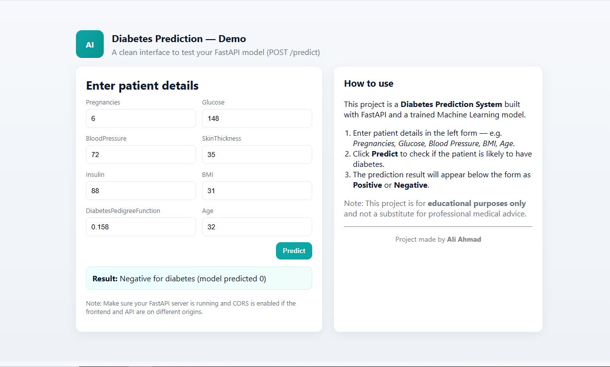

# 🩺 Diabetes Prediction Project  

This is a **Data Science project** where I built a **Diabetes Prediction System**.  
The model predicts whether a person is likely to have diabetes based on health data.  

I used **FastAPI** for the backend, and created a simple **HTML, CSS, and JavaScript frontend** to make it user-friendly.  
Finally, I **Dockerized** the project so it can run easily on any system.  

---

## 🚀 Features
- Machine Learning model for diabetes prediction  
- Backend built with **FastAPI**  
- Frontend made with **HTML, CSS, JavaScript**  
- **Docker support** for easy deployment  
- Simple and clean UI  

---

## 🛠️ Technologies Used
- **Python**
- **Pandas**
- **numpy**
- **seaborn**
- **Scikit-learn**
- **FastAPI**
- **HTML, CSS, JavaScript**
- **Docker**

---
## ⚙️ Setup Instructions  

### 1️⃣ Clone the Repository
```bash
git clone https://github.com/your-username/diabetes-prediction.git
cd diabetes-prediction
```
## 2️⃣ Create a Virtual Environment (Optional)
```bash
python -m venv venv
source venv/bin/activate   # For Linux/Mac
venv\Scripts\activate      # For Windows
```
## 3️⃣ Install Dependencies
bash
pip install -r requirements.txt

## 4️⃣ Run the FastAPI Server
bash
Copy code
uvicorn backend.main:app --reload
Open in browser: http://127.0.0.1:8000

## 5️⃣ Run the Frontend
Open frontend/index.html in your browser

The frontend will send requests to the FastAPI backend

## 🐳 Run with Docker
## 1️⃣ Build Docker Image
bash
Copy code
docker build -t diabetes-prediction .
## 2️⃣ Run Container
bash
Copy code
docker run -p 8000:8000 diabetes-prediction
Now open http://127.0.0.1:8000 to see the app running.

## 📸 Screenshots / Demo



## ✨ Future Improvements
Add more health features for prediction

Improve UI design

Deploy on cloud (AWS / Heroku / Render)

## 👨‍💻 Author
Ali Ahmad

Aspiring Data Scientist & AI/ML Engineer

Linkedin :https://www.linkedin.com/in/ali-ahmad-dawana/


